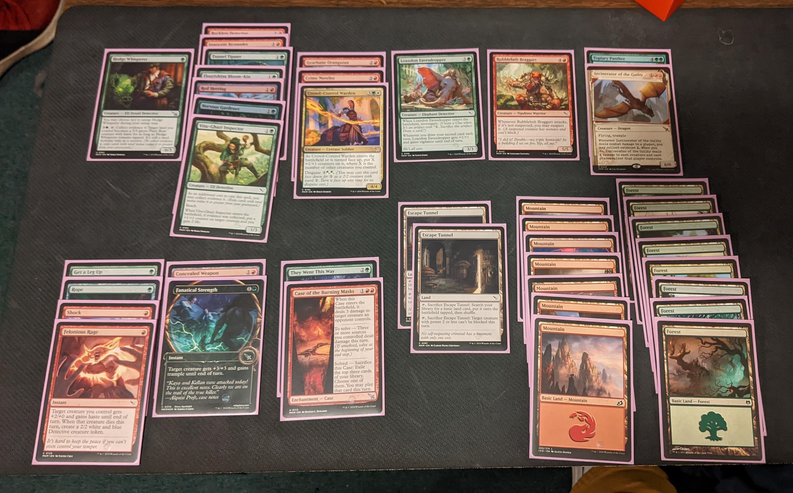
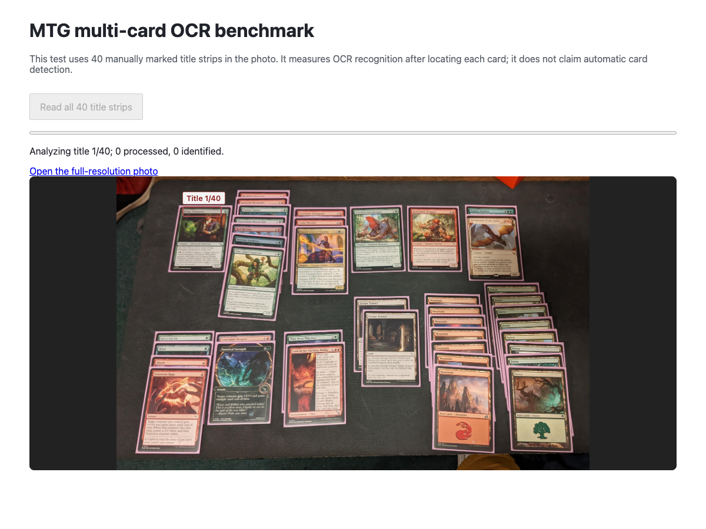

> **Tabletop scanner:** the fresh browser pipeline recovered **12/12 names with zero accepted false matches in 173.5 seconds** on the supplied development photo. See [EXPERIMENT-STATUS.md](EXPERIMENT-STATUS.md) for the upload harness, reproduction commands and limits.

# Browser OCR feasibility test for MTG card names

## Result (20 September 2026)

Browser OCR is feasible for **one readable card at a time**. On 16 Scryfall `normal` card renders (488 × 680 pixels), both engines found every name in at least one title-crop configuration. On a synthetic rotated, blurred, lower-contrast card image, PaddleOCR found 16/16 names and Tesseract found 10/16 near the top of the output. A real camera workflow also needs card detection, orientation correction, and handling of glare or occlusion, which this test did not measure.

| Browser engine and input | Name present in OCR text | Median recognition | 90th percentile | Model setup |
| --- | ---: | ---: | ---: | ---: |
| Tesseract.js 7, wide title crop | 16/16 | 65 ms | 203 ms | 314 ms |
| PaddleOCR.js 0.4.2, wide title crop | 14/16 | 108 ms | 142 ms | 4,287 ms |
| Tesseract.js 7, tight title crop | 14/16 | 48 ms | 82 ms | 336 ms |
| PaddleOCR.js 0.4.2, tight title crop | 16/16 | 92 ms | 138 ms | 4,024 ms |
| Tesseract.js 7, half resolution, tight crop | 16/16 | 44 ms | 91 ms | 82 ms |
| PaddleOCR.js 0.4.2, half resolution, tight crop | 16/16 | 88 ms | 134 ms | 1,840 ms |
| Tesseract.js 7, full card | 16/16 | 540 ms | 891 ms | 81 ms |
| PaddleOCR.js 0.4.2, full card | 16/16 | 730 ms | 934 ms | 1,601 ms |
| Tesseract.js 7, synthetic photo | 10/16 | 387 ms | 700 ms | 324 ms |
| PaddleOCR.js 0.4.2, synthetic photo | 16/16 | 686 ms | 936 ms | 4,290 ms |

These are **single-pass measurements**, not population accuracy estimates. The 90th percentile is the 15th fastest of 16 observations. The first setup figure for each engine includes its initial model load in that browser run. Subsequent setup figures benefited from in-session browser caching. Recognition timings exclude fixture image loading and crop creation. Vite's initial page/module load and Chrome startup are excluded. Hardware was an Apple M4 Max with 48 GB RAM, Chrome 153, macOS. Tests ran headless in Chrome, on the WASM backends. PaddleOCR used the `PP-OCRv5_mobile_det` and `PP-OCRv5_mobile_rec` models.

The score means the known name appeared as a contiguous phrase after lowercasing, replacing punctuation with spaces, and treating separate PaddleOCR text boxes as spaces. For full-card and synthetic-photo runs, it only considers the first three nonempty Tesseract lines or first PaddleOCR text box, to avoid counting a name in rules text. It does **not** mean the entire OCR output was clean. Tesseract's wide crop often included border or art noise; PaddleOCR's wide crop read `Mystic | cRemora` and `Urza's | sSaga`. Tesseract's tight crop read `Lichtnine Bolt` and `Ubza's Sagal.`. Both engines recovered those names under another crop. Whole-card OCR also reads rules text and is slower, so extracting the name from its output requires selecting the title line.

The half resolution test starts from the same pristine renders, downsamples the full card to 244 × 340, then crops and upscales the title. The synthetic-photo case places a 414 × 578 card on a plain gray 600 × 800 background with a 4° rotation, 0.65 px blur, lower brightness, and lower contrast. It is **not a phone-photo test**: perspective, glare, sleeve reflections, hand occlusion, multiple cards, and unusual frames are not represented. The apparent improvement for Tesseract with downsampling is a property of these 16 images and the chosen crop. It should not be generalized without testing the intended input photos.

## Recommendation

For clean, aligned images, start with Tesseract.js: it had the shortest initial setup and fastest title-crop recognition here. For camera-style images where a reliable title crop is unavailable, PaddleOCR.js is the stronger candidate based on the synthetic case, at the cost of a roughly 4-second model setup and roughly 0.7-second recognition per image here. Match the OCR phrase against the app's existing card name index, and show the user a confirmation when several names are plausible. The multi-card photo below shows why a review step is necessary.

## Multi-card photo: card identities and quantities

The user's attached photo is included here: [open the original 3404 × 2118 image](res/multi-card.jpg). The source is the [Reddit post](https://www.reddit.com/r/lrcast/comments/1ayliks/personal_milestone_30_fnm_draft_what_do_you_think/). All scoring is by **card name and quantity**, never by printing or edition.



Manual visual inventory found **40 physical cards with 26 distinct names**. The title boxes and instance counts are recorded in [multi-ground-truth.json](multi-ground-truth.json).

| Count | Card name |
| ---: | --- |
| 8 | Forest |
| 7 | Mountain |
| 2 | Escape Tunnel |
| 1 each | Hedge Whisperer; Reckless Detective; Innocent Bystander; Tunnel Tipster; Flourishing Bloom-Kin; Red Herring; Nervous Gardener; Vitu-Ghazi Inspector; Gearbane Orangutan; Crime Novelist; Crowd-Control Warden; Loxodon Eavesdropper; Rubblebelt Braggart; Topiary Panther; Incinerator of the Guilty; Get a Leg Up; Rope; Shock; Felonious Rage; Concealed Weapon; Fanatical Strength; They Went This Way; Case of the Burning Masks |

The full-image and 12-tile scans did **not** find every identity. The title-box scoring below uses the manual annotations **only for evaluation**; the OCR engines did not receive those boxes for the full-image and tiled runs.

| Browser run | Exact title text at the correct card | Distinct names | OCR time | Model setup |
| --- | ---: | ---: | ---: | ---: |
| PaddleOCR, whole photo | 24/40 | 11/26 | 17.0 s | 4.5 s |
| PaddleOCR, 12 overlapping tiles | 25/40 | 11/26 | 25.0 s | 1.6 s, warm |
| PaddleOCR, 40 manually marked title crops | 23/40 | 10/26 | 7.0 s | 4.4 s |
| Tesseract, 40 manually marked title crops | 5/40 | 3/26 | 3.0 s | 0.3 s |

With manually marked title crops, a printing-independent fuzzy lookup over **34,299 distinct card names** selected the right top candidate for **35/40 card instances (21/26 names)**. At a minimum similarity score of 80, it accepted **34/40 (20/26 names)**, all correct in this test. The other six need review. Five were unreadable or matched incorrectly: Hedge Whisperer, Reckless Detective, Innocent Bystander, Tunnel Tipster, and Red Herring. Flourishing Bloom-Kin was the correct top suggestion but scored only 67, so it was also flagged for review. These are observations on one photo, not a calibrated confidence guarantee.

**Conclusion for this image:** browser-only OCR cannot be relied on to identify all 40 cards automatically. The names are manually visible, but several thin title strips in the upper-left stack produce little or no OCR text. A production flow should show unresolved cards for user confirmation or request a closer second photo. Card-location detection remains a separate unsolved step in this benchmark.

### Progress demo

The local benchmark page shows the photo, a live bar for **40 title regions processed**, and a subtle red outline around the title currently being analyzed. The demo runs PaddleOCR in its dedicated Web Worker. The bar advances when a region finishes; the outline moves when the next region starts. The current count of correct high-confidence suggestions is shown separately. The highlight follows the image when the window is resized. The title regions in this demo are manually annotated, so it demonstrates OCR and review UI rather than automatic card discovery.



## Reproduce

```sh
cd benchmarks/card-ocr
npm install
python3 fetch-images.py
npm run dev
```

In another terminal:

```sh
cd benchmarks/card-ocr
npm run bench
npm run bench:more
npm run bench:photo
npm run summarize
npm run bench:multi
npm run bench:multi:titles
npm run bench:worker
npm run summarize:multi
npm run match:multi
```

`run.mjs` uses the macOS Google Chrome path by default; set `CHROME_PATH` to another Chrome executable if needed. `manifest.json` pins the 16 Scryfall card IDs and image URLs. The downloaded card images and raw result JSON are local, ignored files. Scryfall and Wizards of the Coast retain their respective rights to the card imagery.

To view the progress demo, open `http://127.0.0.1:4173/` while `npm run dev` is running and click **Read all 40 title strips**. `export-card-names.py` rebuilds [res/card-names.json](res/card-names.json) from the repository's MTGJSON SQLite database if its card data changes. Raw OCR results are ignored files; run the commands above to regenerate them.

On the benchmark workstation, Homebrew's Node 24.5.0 binary began failing during this run because its `libsimdjson.26.dylib` dependency disappeared. The final runs used the official Node 24.5.0 binary unpacked at `/tmp/cube-node`. Until the local Node installation is repaired, prefix npm commands with `PATH=/tmp/cube-node/bin:$PATH`.
