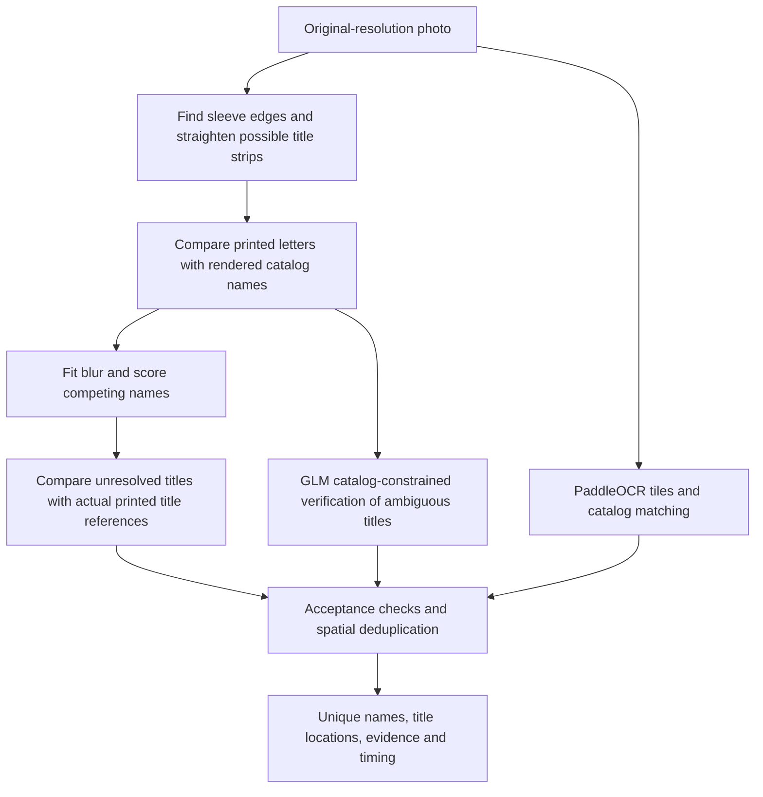

# Client v2

This is a React single-page app built with Vite.

## Development

Use Node.js 20.19+ or 22.12+ and npm. From this directory:

```sh
npm install
npm run dev
```

The development server runs on port 3000 on all interfaces, so it is reachable at `http://localhost:3000` and from the LAN at `http://<hostname>.local:3000`. Start the backend separately. API requests go to port 4040 on whichever host served the page; set `VITE_BACKEND_HOST_URI` before starting Vite to use another backend URL.

## Import cards from a photo

Use **Create a deck from image** on the deck list, or **Add cards in image** while editing a deck. Client v2 now uses the combined pipeline described below: PaddleOCR, automatic title crops, printed-font/reference matching, and GLM verification. Accepted names enter the existing client-side scan/deck-import queue; manual additions remain available. The selected photograph stays in the browser. PaddleOCR runs in a worker; geometry, optical matching and GLM coordination currently also perform work on the main thread.

The complete pipeline requires WebGPU and a secure browser context (HTTPS or localhost). Before building a fresh checkout, install the large GLM weights from the private NAS with `npm run install:ocr`; configure `CUBE_NAS_ROOT` or `CUBE_NAS_URL` as documented in [deploy/README.md](../../deploy/README.md). Small runtime models are checked into Git. `npm run build` verifies all model checksums before bundling.

## Browser-only card-name recognition: experiment and implementation

### Result and integration status

On 21 September 2026, the experimental scanner recovered **all 12 distinct card names, with zero accepted false matches, in 173.48 seconds** from the original 5712 × 4284 `IMG_8535.jpeg`. This was a fresh headless Chrome run: title locations and candidate names were regenerated from the photo, rather than loaded from previous results. Recognition ran entirely in the browser. There is **no artwork matching**.

**Client v2 now uses the 12/12 pipeline.** [card-image-ocr.ts](src/utils/card-image-ocr.ts) adapts the integrated [scanner](src/lib/card-scanner/experimental-scanner.js) to the existing scan queue, progress UI, accepted-candidate list and deck-import behavior. The client integration was independently exercised through this entry point: **12/12 distinct names, zero false acceptances, 174.45 seconds**, with fixture/annotation requests blocked. The production runtime source is in `src/lib/card-scanner`; the benchmark directory retains the experiments and evaluation tools.

The earlier client used only a reused PaddleOCR worker and approximately 1000 × 900 pixel tiles. That simpler implementation has been replaced. The combined pipeline uses the measured 960-pixel configuration below and adds the optical/reference/GLM stages.

The experimental implementation is [experimental-scanner.js](../../benchmarks/card-ocr/experimental-scanner.js), available through [the benchmark harness](../../benchmarks/card-ocr/harness.html). Its compact measured record is [experimental-benchmark-summary.json](../../benchmarks/card-ocr/experimental-benchmark-summary.json). The successful raw run, `photo-results/fresh-integrated-v3.json`, is gitignored along with the private photo, model weights, and intermediate outputs.

### What “12/12” measures

The objective was to recover distinct **names**, not editions or the number of physical cards in overlapping piles. The evaluation has 12 known names across 35 annotated title regions: 19 substantially exposed and 16 partial. Scoring requires both the correct name and a candidate center inside the corresponding annotated region, with a 12-pixel tolerance. Each annotation can receive credit only once. A name recognized elsewhere in rules text does not earn title credit.

| Metric in the successful fresh run | Result |
| --- | ---: |
| Distinct-name recall | **12/12 = 100%** |
| Accepted title instances correctly identified | **17/17 = 100% observed precision** |
| Substantially exposed title instances recovered | 17/19 = 89.5% |
| All annotated title instances recovered, including partial titles | 17/35 = 48.6% |
| Partial title instances accepted | 0/16 |
| Accepted false matches | **0** |

Thus, the run found every known name without finding every visible copy. It does not establish the identities or counts of hidden cards. It also does not establish 100% accuracy on future photos: cropping rules, thresholds, and acceptance policies were developed on this same photo. A separate labeled photo set is still required.

The evaluator's nested `metrics.meetsTarget` concerns 95% **instance recall**, which this run does not meet. The experimental runner's top-level `meetsTarget` concerns **all distinct names**, zero false acceptances, and the request audit; that gate passed. These fields intentionally answer different questions.

The accepted names were Aether Chaser, Aether Swooper, Cloudsculpt Technician, Cryogen Relic, Galvanic Blast, Gearseeker Serpent, Inventor's Axe, Inventor's Goggles, Kenku Artificer, Melded Moxite, Metallic Rebuke, and Selfcraft Mechan. An initial manual annotation incorrectly named Melded Moxite; the user corrected the evaluation label. That incorrect label was not an OCR discovery.

### How the successful pipeline works



#### 1. Read the easier names with PaddleOCR

[photo-scan.js](../../benchmarks/card-ocr/photo-scan.js) preserves the original photo resolution and scans 960-pixel tiles with 200-pixel overlap. The successful run processed 48 tiles, using the v5 mobile detector and v6 small recognizer with detection thresholds of 0.1 and 0.3. Overlap helps avoid cutting names at tile boundaries; small tiles keep title lettering large enough for the detector.

[photo-match.js](../../benchmarks/card-ocr/photo-match.js) normalizes case, punctuation and accents, uses character trigrams to shortlist up to 180 catalog entries, and ranks those by normalized edit distance. It filters likely rules/type text and merges overlapping observations. The normal acceptance rule requires name similarity at least 0.84, OCR score at least 0.75, a sufficiently long string, and a margin of at least 0.12 over the next name unless the match is exact. These are heuristic scores, not calibrated probabilities.

This stage found seven names. The final combined pipeline uses this one sensitive OCR pass; the older 101.6-second baseline used three passes and found more repeated title instances but still only seven distinct names.

#### 2. Locate and compare printed title lettering

[fresh-proposals.js](../../benchmarks/card-ocr/fresh-proposals.js) runs three complementary searches:

- **Light title bands:** find light backgrounds within potential title strips, then locate connected ink components.
- **Ink bands:** search a wider range of components and light bands, comparing against slightly blurred text templates.
- **Perspective-corrected plane:** infer a planar perspective transform from an automatically detected orange-sleeved quadrilateral, then repeat the title search in the rectified image.

[title-proposals.js](../../benchmarks/card-ocr/title-proposals.js) and [edge-titles.js](../../benchmarks/card-ocr/edge-titles.js) use orange-color masks, line detection, and joining of approximately collinear fragments. They do not receive annotated card coordinates. The plane method assumes approximately coplanar cards and a normal card aspect ratio; overlapping piles and other sleeve colors limit it.

[font-ocr.js](../../benchmarks/card-ocr/font-ocr.js) renders names from the full 34,299-name catalog in the Beleren font, excluding `A-` digital rebalances from matching. Each candidate strip and rendered title is normalized to 96 × 16 pixels. Subtracting each row's average brightness suppresses background variation. A horizontal projection shortlists 100 names; a normalized pixel comparison reranks them and retains five candidates. This compares the **shape of printed letters**, not the card illustration.

The three passes produced 4,069 proposals in the final run. [refine-font.js](../../benchmarks/card-ocr/refine-font.js) then fitted horizontal and vertical blur to the shortlisted rendered names, processing 2,220 retained proposals. A fit of at least 0.75 and a lead of at least 0.12 can be accepted, subject to minimum-length and spatial-duplication checks. This recovered Inventor's Axe, Cloudsculpt Technician, and Melded Moxite, taking the cumulative count to ten.

#### 3. Resolve typography differences using real printed title strips

A rendered font does not reproduce every printed frame, spacing choice, or older typeface. [reference-titles.js](../../benchmarks/card-ocr/reference-titles.js) therefore compares unresolved candidates against title lettering cropped from reference printings. The reference catalog contains 40,289 printing identifiers covering 33,309 normal-layout names, with up to two frame versions per name. It is generated from the repository's `AllPrintings.sqlite` database.

Candidate names come from the fresh full-catalog search. Only their needed reference images are loaded, first from local assets and then from Scryfall if absent. Although the downloaded resource is a card image, the algorithm crops its title band and compares only the lettering. It handles dark and light lettering, normalizes the title to the same feature space, and fits blur before comparing it with the photo. The final acceptance threshold is 0.85 with a 0.15 lead over the next candidate.

The final run evaluated 27 unresolved regions using 110 reference printings. This recovered **Galvanic Blast**, taking the cumulative count to eleven. In the earlier isolated reference experiment, Galvanic Blast scored approximately 0.915 versus 0.720 for the next candidate. The rendered-font method had left it nearly tied with Thermal Blast. The improvement supports using actual printed typography when synthetic font rendering is insufficient; it is not evidence for matching artwork.

#### 4. Verify ambiguity with GLM and the full catalog

[catalog-region-reader.js](../../benchmarks/card-ocr/catalog-region-reader.js) runs GLM-OCR with FP16 ONNX weights through Transformers.js/WebGPU. It sees a straightened, enlarged title crop and the prompt `Text Recognition:`.

[catalog-logits.js](../../benchmarks/card-ocr/catalog-logits.js) builds a token-prefix tree from the complete name catalog. During generation, it masks token continuations that cannot lead to a catalog name. Termination is permitted at a complete name, or initially to allow abstention. It evaluates optical seed names and a bounded set of alternative token prefixes. This is **bounded hypothesis search**, not exhaustive evaluation of all names or a true beam-search implementation; canonical tokenizations plus leading-space/newline variants are represented.

Crucially, it records token likelihoods **before** masking. A forced legal name can otherwise appear confident merely because alternatives were removed. Even with this safeguard, the standalone constrained model produced false real-card names in experiments. The successful pipeline therefore does not trust its standalone `accepted` flag.

[consensus.js](../../benchmarks/card-ocr/consensus.js) accepts a GLM suggestion only when the optical matcher also ranks that name first at the same location. Current thresholds are optical similarity at least 0.5, unmasked token geometric-mean support at least 0.03, and a mean log-likelihood gap of at least 0.15 over the next searched hypothesis. The name must contain at least eight alphabetic characters. The optical candidates seed GLM's search, so agreement must not be described as two statistically independent confidence estimates.

For a close decision where the best GLM and optical names already agree, the verifier can retry up to three alternate geometries previously generated from the image. It keeps the acceptance threshold unchanged. The final run made 18 verifications across 17 selected regions. This recovered **Inventor's Goggles** and one additional Metallic Rebuke title instance, reaching twelve distinct names and seventeen title instances.

### Verifier ablation: replacing GLM with a smaller model

On 22 September 2026 (UTC) we held the image, preprocessing, title proposals, font/reference matching and acceptance cutoffs fixed, then compared three final-stage choices in fresh Chrome sessions. The no-GLM modes blocked requests to every GLM asset and hid `navigator.gpu`; neither attempted to fetch a GLM asset. All three runs scored against annotations only after recognition finished.

| Final verifier | Correct distinct names | Correct title instances | False matches | Whole scan | Verifier stage | Sampled summed Chrome RSS peak |
| --- | ---: | ---: | ---: | ---: | ---: | ---: |
| No final verifier | 11/12 | 15 | 0 | 139.74 s | 0.00 s | 4.23 GiB |
| Paddle v6 medium (WASM) | 12/12 | 17 | 0 | 148.07 s | 6.96 s | 3.87 GiB |
| GLM-OCR FP16 (WebGPU) | 12/12 | 17 | 0 | 222.56 s | 53.20 s | 6.78 GiB |

**GLM added one unique name (Inventor's Goggles) and one additional Metallic Rebuke instance over omitting verification. The 73.01 MiB Paddle v6 medium recognizer recovered those same two instances, so GLM added no observed accuracy over that smaller verifier on this photo.** This is still one development fixture, not proof that their accuracy is equal across other images.

The smaller model is being used as a **verifier**, not being asked to rediscover all cards. [paddle-region-reader.js](src/lib/card-scanner/paddle-region-reader.js) receives the same automatically selected title regions and candidate names used by the GLM verifier. A WASM worker runs PP-OCRv6_medium_rec on each crop. A CTC prefix search over the catalog proposes additional alternatives, and [ctc-candidate-score.js](src/lib/card-scanner/ctc-candidate-score.js) evaluates exact CTC forward likelihoods for the optical seeds and those alternatives. It sums valid character/blank alignments, handles repeated letters, and retains the original model probabilities rather than renormalizing them over the allowed names.

The same optical-name agreement, minimum-length, support and margin checks are then applied. CTC support is normalized by characters, while GLM support is normalized by tokens; their numeric scores are not calibrated or directly comparable confidence probabilities. The cutoffs were kept fixed for this ablation. In a preliminary verifier-only test on 18 cached crop geometries, the approximately 20 MiB small recognizer took 1.82 s and stayed at 11/12; the 73 MiB medium recognizer took 5.80 s and reached 12/12; the 81 MiB server recognizer took 5.84 s and stayed at 11/12. The medium result was subsequently confirmed by the fresh full run above. Cached-crop timings are not full scan times.

The compact configuration needs **109,424,484 bytes / 104.36 MiB of declared assets in total**, including catalogs, the font, the two initial Paddle model archives, and the medium verifier/configuration. Its largest model is **76,554,979 bytes / 73.01 MiB**; no individual model exceeds 100 MiB. The GLM configuration needs **2,254,006,369 bytes / 2,149.59 MiB**. Model/runtime JavaScript, WASM binaries and on-demand reference images are additional. Compact recognition uses WASM and does not require WebGPU, although the browser can still use its GPU for ordinary Canvas/compositing.

The current installed asset manifest contains both verifier alternatives. The deployed default remains GLM until configured otherwise; the compact mode can be selected with `scanCardImage(file, names, onProgress, isCancelled, { verifier: 'paddle-medium' })`, or `scanExperimental({ url, names, verifier: 'paddle-medium' })`. Use `verifier: 'none'` to stop after reference matching. The legacy `useGLM: false` option also selects no verifier. GLM is imported lazily, so it is not initialized by compact scans.

These are single-run observations, not a guaranteed speedup or memory minimum. The GLM control's earlier stages also ran more slowly (54.86 s for initial OCR and 94.10 s for font proposals, versus 36.27 s and 85.17 s in the medium run), so the entire end-to-end difference cannot be attributed solely to verification. Previous GLM runs took 173–192 s overall. Likewise, the no-verifier run's slightly higher RSS than the medium run reflects allocation/collection and run-to-run variation; adding a model is not a memory optimization by itself. The compact pipeline still used several GiB because image copies, font indexes and browser/native allocations remain.

The implementation corresponds to the standard Paddle diagram as follows:

| Standard Paddle module | Used here? |
| --- | --- |
| Document Image Orientation Classification | Disabled |
| Text Image Unwarping | Disabled; our card-plane perspective correction is separate custom geometry |
| Text Line Orientation Classification | Disabled; title deskew/crop geometry is handled separately |
| Text Detection | PP-OCRv5_mobile_det in the tiled first pass |
| Text Recognition | PP-OCRv6_small_rec in the first pass; PP-OCRv6_medium_rec for optional compact verification |

Our catalog/font/reference matching and final verification sit around those detection/recognition modules. This is not the untouched default Paddle document pipeline, and enabling its optional YAML flags alone would not reproduce the card-specific flow.

Evidence: [verifier-ablation-summary.json](../../benchmarks/card-ocr/verifier-ablation-summary.json). Reproduce against the corresponding production preview build from `benchmarks/card-ocr`:

```sh
PROFILE_ORIGIN=http://127.0.0.1:4174 PROFILE_RUNS=1 PROFILE_VERIFIER=none PROFILE_ID=ablation-no-glm node profile-client-memory.mjs
PROFILE_ORIGIN=http://127.0.0.1:4174 PROFILE_RUNS=1 PROFILE_VERIFIER=paddle-medium PROFILE_ID=ablation-paddle-medium node profile-client-memory.mjs
PROFILE_ORIGIN=http://127.0.0.1:4174 PROFILE_RUNS=1 PROFILE_VERIFIER=glm PROFILE_ID=ablation-glm-control node profile-client-memory.mjs
node summarize-verifier-ablation.mjs
```

### Where the time goes

All times below come from the same successful fresh run; stages are sequential and their costs can be added.

| Stage | Work performed | Time | Share of total | Cumulative correct names |
| --- | --- | ---: | ---: | ---: |
| PaddleOCR and catalog matching | 48 original-resolution tiles | 40.63 s | 23.4% | 7/12 |
| Title proposals and rendered-font search | 558 light + 2,413 ink + 1,098 rectified proposals | 82.46 s | 47.5% | Candidate generation |
| Blur-aware font refinement | 2,220 proposals | 10.76 s | 6.2% | 10/12 |
| Actual printed-title comparison | 27 regions, 110 reference printings | 6.31 s | 3.6% | 11/12 |
| GLM verification and agreement checks | 18 evaluations, including one geometry retry | 32.08 s | 18.5% | 12/12 |
| Other orchestration and image work | — | 1.25 s | 0.7% | — |
| **Total** | **Fresh image-to-result run** | **173.48 s** | **100%** | **12/12** |

Within proposal generation, the light pass took 20.03 s, ink pass 36.45 s, and rectified pass 25.98 s. Included setup costs were 5.56 s for PaddleOCR, 6.09 s for reference loading/preprocessing, and 2.92 s for GLM setup. Those setup times are already inside the stage totals.

These are single-run wall-clock measurements on the development macOS arm64 workstation using headless Chrome, not medians or phone-performance estimates. Model initialization is included; initial model installation/download, browser launch and page/module startup are not. Some reference files were already available locally. Network and cache state affect subsequent runs. The earlier benchmark environment was recorded as Chrome 153 on an Apple M4 Max with 48 GB RAM; the final compact result does not independently record a hardware inventory.
### Accuracy and speed of the alternatives

The tables distinguish full-photo runs from crop/component experiments. **A crop experiment's time excludes any earlier work needed to generate its cached crops.** “Correct names” means accepted, location-verified names under that experiment's matching policy, not every plausible name somewhere in its output. Zero accepted names does not mean that the engine emitted no text.

#### Automatic scans of this photo

The earlier OCR-only measurements are preserved in [photo-benchmark-summary.json](../../benchmarks/card-ocr/photo-benchmark-summary.json).

| Method | Time | Correct distinct names | Name recall | Accepted false matches |
| --- | ---: | ---: | ---: | ---: |
| Tesseract, 1400-pixel tiles | 18.08 s | 0/12 | 0% | 0 |
| PaddleOCR, entire photo in one input | 7.64 s | 0/12 | 0% | 0 |
| PaddleOCR, 1400-pixel tiles | 27.09 s | 6/12 | 50.0% | 0 |
| PaddleOCR, sensitive 960-pixel tiles | 42.07 s | 7/12 | 58.3% | 0 |
| PaddleOCR, v6 detector, 1400-pixel tiles | 32.35 s | 5/12 | 41.7% | 0 |
| Direct small recognizer on automatic sleeve-edge strips | 25.93 s | 5/12 | 41.7% | 0 |
| English-specific recognizer on edge strips | 17.17 s | 5/12 | 41.7% | 0 |
| Larger v5 server recognizer on edge strips | 119.86 s | 3/12 | 25.0% | 0 |
| Contrast-enhanced direct recognition | 26.69 s | 5/12 | 41.7% | 0 |
| Aspect-stretched direct recognition | 15.86 s | 5/12 | 41.7% | 0 |
| Older three-pass Paddle/edge pipeline | 101.61 s | 7/12 | 58.3% | 0 |
| First completed fresh combined pipeline, before final fixes | 174.53 s | 11/12 | 91.7% | 1 |
| **Final fresh combined pipeline** | **173.48 s** | **12/12** | **100%** | **0** |

The 42.07 s sensitive-tile experiment and the final pipeline's 40.63 s Paddle stage are separate runs of similar configurations. They are not conflicting measurements. More model capacity alone did not help: the server recognizer was slower and recovered fewer names on its edge proposals.

#### Focused GLM, PARSeq and reference experiments

| Method and scope | Measured time | Accepted correct distinct names | Accepted false matches | Interpretation |
| --- | ---: | ---: | ---: | --- |
| GLM unrestricted OCR + conservative catalog matching, 91 cached title proposals | 16.97 s | 6 | 0 | Useful on some titles; did not recover all names |
| GLM constrained to catalog, first 12 selected crops | 27.95 s | 0 | 2 | Early decoder/search implementation was unsuitable |
| GLM constrained, revised 20-crop run | 34.59 s | 0 | 2 | Legal card names could still be incorrect |
| GLM constrained, revised 18-crop run | 36.95 s | 1 | 4 | Standalone confidence rule still failed |
| GLM constrained, 60 preserved crops | 168.65 s | 2 | 13 | Rejected as a standalone acceptance method |
| GLM unrestricted OCR, 30 larger card crops | 72.37 s | Not scored for acceptance | Not scored | Plausible but incorrect rules text; excluded from the final decision |
| PARSeq, non-autoregressive decoding + two refinements, 60 cached crops | 9.12 s | 1 | 0 | No additional difficult name recovered |
| PARSeq, autoregressive decoding + one refinement and padding, 60 cached crops | 9.80 s | 0 | 0 | No improvement on these crops |
| Actual printed-title references, 60 cached proposals / 352 cached printings | 3.34 s | 2 | 0 | Recovered Galvanic Blast and Melded Moxite at the strict threshold |
| Broader synthetic-font blur fitting, combined with cached baseline results | 118.44 s for refinement only | 10 | 11 | More flexible fitting also fit noise; rejected |

The 168.65 s GLM run overlapped a separate blur experiment, so it is not an isolated performance benchmark. Its recorded cost was 0.42 s crop selection, 2.79 s model/catalog setup, and 165.43 s preprocessing/inference/search. The final GLM stage evaluates only unresolved regions and requires optical agreement; its 32.08 s cost is for different work, not evidence that the same model suddenly became five times faster.

PARSeq was exported from the official weights to ONNX. A boolean operation unsupported by the browser runtime was replaced with an equivalent expression. Browser-versus-PyTorch maximum logit differences were approximately 0.0000095 and 0.0000129 for the two exports. This rules out a large conversion error on that check input; it does not validate recognition quality or all possible inputs. The tested crops and decoding configurations were simply not effective enough here.

#### Additional exploratory attempts

These saved runs did not establish an additional reliable name beyond the accepted combination. A consistent final acceptance score was not recorded for all of them, so no fabricated accuracy percentage is assigned.

| Approach | Recorded component-run time | Scope and outcome |
| --- | ---: | --- |
| Florence-2 base fine-tuned model | 4.52–17.20 s | Separate runs on two tiles, seven contact sheets, or seventy strips; weak title reading and no verified addition |
| TrOCR small printed | 12.71 s | Sixteen strips; unrelated or incorrect text, no verified addition |
| MGP-STR | 111.86 s | 108 strips with character/catalog scoring; no verified improvement |
| Visions MTG recognizer, converted to ONNX | 1.53–3.44 s | Separate 132–210-crop runs, including lexicon decoding; no verified improvement on the hard names |
| Synthetic-font fine-tuning of the Visions model | 2.62–2.97 s inference | Full-catalog synthetic training; these times exclude training. Synthetic validation did not translate to a verified real-photo gain |
| Qwen3-VL 2B | 13.62 s | Two contact sheets; repeated or incorrect text, no verified addition |
| Tesseract best-data direct-line run | 15.56 s | Seventy strips; no verified addition |
| Deblurring, sharpening, alternate fonts, word splitting and text-region filtering | No single comparable total | Tried as preprocessing/selection variations; did not independently close the gap |

The models above were tested with particular exports, crop formats and settings. These are findings about this experiment, not universal rankings of the model families. **PP-OCRv5/v6 is not PaddleOCR-VL-1.5:** the latter was investigated but not successfully benchmarked here. Text-specific super-resolution was researched as a fallback but not run after printed-title matching resolved the missing name.

Earlier milestones of 9/12, 10/12 and 11/12 combined cached research outputs. Their complete image-to-result times were not measured and must not be inferred by selectively adding favorable component timings. The final 173.48 s run replaces those milestones as the reproducible combined result.

### Why the last corrections mattered

The successful method depends as much on crop quality and rejection rules as on the OCR model:

- A filter previously dropped an entire proposal when its first candidate was short, even if another candidate was a plausible longer title. Keeping that proposal allowed refinement to recover Melded Moxite.
- Removing a nested title crop because a larger surrounding crop existed could discard the actual readable letters. Preserving useful alternate geometries helped recover Inventor's Goggles.
- The initial fresh combined run accepted **Rebuke** from a partial title. The consensus path lacked the conservative minimum-length rule used elsewhere. Adding it rejected that fragment; a regression test now covers the failure. This also means short legitimate names need a separate acceptance policy.
- Inventor's Goggles remained first-ranked but below the margin on one regenerated crop. A retry using another already-generated geometry cleared the unchanged threshold. No expected name or hand-entered rectangle was supplied at runtime.
- A missing local reference image was initially returned as an HTML fallback page by the dev server. The loader now checks the response content type before decoding and falls back to the reference CDN.

### Confidence, privacy and resource limits

A string existing in the MTG catalog is not evidence that it is in the photo. Likewise, 0.9 optical similarity, high OCR confidence, and GLM token support are different measurements. The UI's match scores should not be presented as probabilities. They also should not be pooled as independent votes: crop retries and seeded model searches share evidence.

The browser harness blocks requests to the annotation file and saved experiment-result directory during fresh recognition. Evaluation runs afterward in Node. The successful run recorded **zero requests to either blocked fixture source and zero non-GET/HEAD requests**. All image analysis stayed in Chrome. Model/runtime assets and reference images may be downloaded; this is browser-local computation, not a fully offline application. The audit checks a known implementation and is not a general network-security proof.

### Model and runtime asset sizes

Sizes below are measured from the installed files in [deploy/ocr-assets.json](../../deploy/ocr-assets.json). **MiB means 1,048,576 bytes; GiB means 1,073,741,824 bytes.** File size, transferred bytes, JavaScript heap size and resident process memory are different measurements.

| Deployed asset | Exact bytes | Size | Distribution |
| --- | ---: | ---: | --- |
| Paddle v5 mobile detector, ONNX archive | 4,843,520 | 4.62 MiB | GitHub |
| Paddle v6 small recognizer, ONNX archive | 21,319,680 | 20.33 MiB | GitHub |
| Optional Paddle v6 medium verifier, ONNX | 76,554,979 | 73.01 MiB | GitHub |
| Medium verifier character dictionary/configuration | 150,580 | 0.14 MiB | GitHub |
| GLM FP16 decoder external weights | 1,164,318,720 | 1,110.38 MiB | NAS |
| GLM FP16 token embeddings external weights | 182,452,224 | 174.00 MiB | NAS |
| GLM FP16 vision encoder external weights | 868,340,736 | 828.11 MiB | NAS |
| GLM ONNX graph files, tokenizer and configuration combined | 6,175,764 | 5.89 MiB | GitHub |
| Full card-name catalog | 658,950 | 0.63 MiB | GitHub |
| Printing/reference identifier catalog | 5,838,595 | 5.57 MiB | GitHub |
| Beleren title font | 58,180 | 0.06 MiB | GitHub |
| **All 21 assets, including both verifier alternatives** | **2,330,711,928** | **2,222.74 MiB / 2.17 GiB** | **110.24 MiB GitHub + 2,112.49 MiB NAS** |

The installed superset is **2.331 GB in decimal units**. A GLM-only configuration uses 2.254 GB; the compact-verifier configuration uses 109.42 MB, as detailed in the ablation above. GLM's complete model/configuration directory alone is 2,221,287,444 bytes (2,118.38 MiB). The three NAS files are 2,215,111,680 bytes combined. Each exceeds GitHub's normal 100 MiB per-file limit. Small ONNX graph files refer to those external weights; checking in a graph does not make its large weight file optional. The installer verifies both size and SHA-256 before accepting an asset.

These figures exclude the application JavaScript, runtime libraries, reference card images, browser caches, and experimental models that are not deployed. The build contains approximately 27.00 MiB and 25.62 MiB ONNX Runtime Web WASM binaries for different execution paths; presence in `dist` does not mean every path downloads both. OpenCV and other library code also contribute to the scanner JavaScript chunk. Paddle's SDK can load its own runtime assets separately. Needed reference printings are downloaded on demand—the successful scan used 110—but the app does not download the entire printing catalog's images.

The first installation from the NAS copies the large files onto the application host. A fresh browser must then fetch whichever deployed model/runtime assets it needs from that host. Initial NAS installation time, browser download time, model initialization time and recognition time must be budgeted separately. Model weights being cached does not mean the in-memory model session is reused: the current scanner reconstructs its GLM session and disposes it on every scan, and Transformers' application-level browser model cache is disabled in this implementation. HTTP caching is a separate mechanism.

For comparison, the other prepared model exports have these sizes. Most were not selected; the medium Paddle model later succeeded in the verifier role described above. This table measures model/graph payloads, excluding tokenizer/configuration files and diagnostic tensors; it is **not** a RAM benchmark or a proposal to download all of these in the client.

| Experimental model/export | Prepared model payload | Used in deployed pipeline? |
| --- | ---: | --- |
| Paddle v5 English recognizer, ONNX | 7.48 MiB | No |
| Paddle v5 server recognizer, ONNX | 80.59 MiB | No |
| Paddle v6 medium recognizer, ONNX | 73.01 MiB | Optional compact verifier |
| Tesseract English best trained data | 14.69 MiB | No |
| Florence-2 base FT, FP16 vision/embeddings + Q4 encoder/decoder | 340.62 MiB | No |
| TrOCR small printed, Q8 encoder/decoder | 60.66 MiB | No |
| MGP-STR, quantized | 143.29 MiB | No |
| PARSeq, non-autoregressive + refinement | 91.26 MiB | No |
| PARSeq, autoregressive + refinement | 92.85 MiB | No |
| Qwen3-VL 2B, Q4F16 decoder/embeddings + FP16 vision | 1,758.43 MiB | No |
| Visions recognizer ONNX | 1.14 MiB | No |
| Visions synthetic-font fine-tuned recognizer ONNX | 1.14 MiB | No |

A small model can still perform poorly on blurred titles, and a large model can confidently choose the wrong name. The earlier accuracy tables describe what these specific exports achieved; no runtime-memory ranking was measured for these rejected alternatives.

### Why live memory is much larger than model storage

The code's explicitly sized buffers explain part of the demand, but they are not an exhaustive memory accounting:

- One decoded RGBA copy of the 5712 × 4284 photo occupies **97,880,832 bytes / 93.35 MiB**. ImageBitmap, Canvas, OpenCV input/output matrices and perspective-corrected images may hold additional copies or differently sized surfaces.
- After excluding 204 `A-` names, the font index contains **34,095 entries**. Its 96 × 16 Float32 descriptors occupy **199.78 MiB**; its 96-element projections add **12.49 MiB**, for **212.26 MiB of typed-array payload per index**, before strings and JavaScript objects.
- The current light, ink and plane passes build indexes separately. References to an old index going out of scope do not force immediate garbage collection. The ink and plane indexes use the same blur setting and could be reused.
- ONNX loading can involve downloaded buffers, parsed/converted tensors, WASM linear memory, WebGPU buffers, intermediate activations, decoding state and allocator pools. The model file size is neither peak RAM nor peak GPU-memory usage.
- The full diagnostic scanner retains per-stage outputs until it returns. The client adapter retains accepted candidates for the queue and releases its object URL afterward, but that does not immediately return all native, WASM or GPU allocations to the operating system.

### Measured runtime memory and responsiveness

The deployed production bundle was profiled on **21 September 2026, Chrome 153.0.8010.52, macOS arm64, Apple M4 Max, 48 GiB RAM**. Two consecutive scans ran in the same fresh browser session against `http://127.0.0.1:3000`, without forcing garbage collection between them. Both still recovered all twelve names with zero accepted false matches. These instrumented timings supplement, rather than replace, the earlier 173.48 s unprofiled benchmark.

| Measurement | First scan | Repeat scan, same tab |
| --- | ---: | ---: |
| Measured scan time | 179.52 s | 192.37 s |
| Correct names / accepted false matches | 12/12 / 0 | 12/12 / 0 |
| Sampled peak, summed Chrome process RSS | 6.31 GiB | 6.85 GiB |
| Main-page JavaScript heap sampled peak | 140.6 MiB | 152.5 MiB |
| GPU helper process sampled peak RSS | 1084.0 MiB | 1425.0 MiB |
| Summed process RSS after 10 seconds idle | 4.05 GiB | 5.15 GiB |
| Main-page JS heap after 10 seconds idle | 19.1 MiB | 11.3 MiB |
| Main-thread tasks longer than 50 ms | 346 | 345 |
| Longest main-thread task | 11.24 s | 12.82 s |
| Sum of task duration beyond 50 ms | 74.67 s | 91.82 s |
| Page-observed encoded transfer bytes | 2.264 GB | 2.228 GB |

The idle browser/fixture baseline before importing the scanner was **1.05 GiB summed RSS**. After the second scan and a separate diagnostic forced garbage collection, summed RSS remained **5.15 GiB**, while the main-page JS heap was only **11.0 MiB**. Reclaiming JavaScript objects therefore did not return the whole process footprint to its initial level. Native/WASM/GPU allocations, pools, code and browser caches are outside that heap number. Two scans are insufficient to establish a leak, a steady-state plateau or a safe maximum queue length.

The repeat scan was approximately **7.2% slower**, despite reference loading/comparison dropping from **13.41 s to 1.21 s**. Font proposal work increased from **83.39 s to 99.44 s**, and GLM work from **34.91 s to 40.80 s**. These two observations do not identify the cause of the slowdown; an allocation/GC trace and a larger repeat-run sample would be needed. The observed multi-gigabyte transfer on the repeat also shows that a second scan is not equivalent to retaining an initialized model in memory.

The long tasks matter for the UI: an 11–13 second task can prevent main-thread input and progress updates during that interval. The reported “sum beyond 50 ms” is the sum of `max(task.duration - 50 ms, 0)` over the scan, not a Lighthouse score or one continuous freeze. The model inference being browser-local does not make all of the surrounding image processing nonblocking.

#### Measurement method and limits

[profile-client-memory.mjs](../../benchmarks/card-ocr/profile-client-memory.mjs) launches an isolated headless Chrome instance and identifies its process tree through the browser DevTools connection. It samples OS RSS roughly every second and the main-page DevTools JavaScript heap roughly every two seconds; 396 process samples were recorded in this session. It also records long tasks and page-observed network transfer counts. The original JPEG is materialized as a Blob URL before the timed scan, and the baseline includes that automation/fixture setup. Model installation is excluded. Normal HTTP caching remains enabled; no Playwright request-routing interception is used. Saved recognition results and annotations are blocked, and scoring occurs after each scan outside the browser.

- **Summed RSS is a process-tree measurement**, including the browser, renderer, GPU helper and utility processes. It excludes the Node profiler and application servers, and excludes the user's other Chrome instance. Shared pages may be counted more than once. It is not unique physical memory attributed solely to the scanner.
- **GPU-process RSS is CPU-visible resident memory of that process**, not a measurement of all WebGPU/Metal buffer allocations or VRAM. On this unified-memory machine, the two must not be equated. Total GPU allocation and private physical footprint were not directly measured.
- **JavaScript heap is only the main-page JS heap.** It does not comprehensively account for worker heaps, typed-array backing stores, WASM linear memory, Canvas/image surfaces or GPU allocations. This is why a roughly 150 MiB heap can accompany several GiB of process RSS. See [Chrome's distinction between OS and JS memory](https://developer.chrome.com/docs/devtools/memory-problems).
- **Peaks are sampled maxima.** Shorter transient spikes may be missed. Memory samples carry the last reported progress label; the following model's setup may begin before another progress event arrives. The raw phase labels are not per-model allocation accounting.
- **Network counts are page-observed encoded bytes**, not a complete accounting of workers, other browser processes, TLS overhead or every transferred asset. They are useful diagnostics, not a replacement for the exact file manifest.
- System-wide reported swap usage was **229.44 MiB before and after**. This is a net system counter, not proof that the scan performed no paging or compression.

The compact evidence is [memory-benchmark-summary.json](../../benchmarks/card-ocr/memory-benchmark-summary.json). Raw samples are in the gitignored `photo-results/client-memory-profile.json`. The baseline and memory retained after a scan are part of this experiment, not a guaranteed minimum or maximum device-RAM requirement. No mobile-memory, mobile-thermal, battery, allocation-bandwidth or multi-photo endurance benchmark has been completed.

#### Reproduce this profile

With the production client running and the local benchmark photo present, run from `benchmarks/card-ocr`:

```sh
# Defaults to the deployed localhost:3000 build and two scans.
node profile-client-memory.mjs
node summarize-memory.mjs
```

`PROFILE_ORIGIN` selects another deployment of the same built assets; `PROFILE_RUNS` selects the number of consecutive scans. The profiler reads the scanner chunk name from `projects/clientv2/dist/assets`, so that local build must correspond to the deployment being profiled. The current OS sampler uses macOS `ps` and `sysctl`, and the harness defaults to this workstation's Chrome executable. It needs adaptation for other platforms. The forced-GC diagnostic runs only after all measured scans and their idle periods.

### Resource tradeoffs to address next

The measured footprint is currently suited to a desktop experiment; a supported minimum RAM specification has not been established. The next engineering changes should be tested for both time and peak/retained memory:

1. **Reuse font indexes and reduce duplicate proposals.** A cached index deliberately retains about 212 MiB of typed arrays, but can avoid repeated rendering, allocation and collection. The ink and plane passes can share one index. Reuse is a latency/idle-memory tradeoff, not a free memory reduction.
2. **Move heavy CPU phases off the UI thread.** Geometry and glyph comparison need a worker/OffscreenCanvas-compatible implementation or finer yielding. A worker improves responsiveness but does not automatically reduce total memory; copying full images between workers could increase it.
3. **Choose an explicit model lifetime.** Reusing GLM can avoid repeated weight transfers and initialization, while keeping model memory resident between jobs. Conversely, terminating an isolated processing context between batches may release more resources, at the cost of cold startup. Both policies need repeat-scan measurements.
4. **Reduce working copies and retained diagnostics.** Close ImageBitmaps, delete OpenCV matrices, dispose tensors, and avoid retaining full intermediate pass outputs when the UI only needs accepted candidates. Disposal calls alone do not prove that browser/native allocators returned memory to the OS; verify with process measurements.
5. **Validate lighter model/precision options against accuracy.** Smaller weights do not guarantee lower peak memory or preserved recognition. Any quantization, smaller recognizer or reduced resolution must rerun the distinct-name/false-acceptance gate and an independent photo set.


### Reproduce the benchmark

Use Node 22.12+ or a compatible newer Node, Python 3 for reference metadata preparation, and Chrome with WebGPU. The commands below are from this README's directory, `projects/clientv2`:

```sh
cd ../../benchmarks/card-ocr
npm install
npm run prepare:photo -- --photo=/absolute/path/to/IMG_8535.jpeg
node prepare-font.mjs
node prepare-glm.mjs
python3 prepare-reference-catalog.py
npm run dev
```

The metadata preparation reads `projects/server/src/assets/AllPrintings.sqlite`. The reference loader can fetch uncached printings; reproducing the scan does not require the old photo-specific reference-download script. Model preparation can involve large downloads. On the development workstation, `PATH=/tmp/cube-node/bin:$PATH` was used because its Homebrew Node installation was broken; this is not a general installation requirement.

Open <http://127.0.0.1:4173/harness.html> and select **Experimental OCR + printed title matching**. The harness supports photo upload, progress, evidence overlays and JSON export. In another terminal, from `benchmarks/card-ocr`:

```sh
npm run test:photo
npm run bench:experimental:gate
```

The successful development session passed **18 regression tests**, the distinct-name benchmark gate, and a UI check comparing the displayed/exported names with the measured result. The gate fails for missing expected names, accepted false matches, or forbidden fixture/non-read requests. The older `bench:tabletop` command runs the seven-name baseline, not the final combined method. The Python/PyTorch PARSeq export tools belong to discarded model experiments and are not prerequisites for the successful scanner.

The browser entry point is `scanExperimental({ url, names, onProgress, isCancelled })`. `url` can be an object URL for a selected `File`; release it after the scan. `names` must be the available card catalog, not the expected contents of the photograph. The result contains unique accepted `names`, located `candidates` and their evidence, raw `passes`, and `totalMs`. The integrated client adapter passes an object URL and the application catalog, maps accepted evidence into the existing candidate type, and reports monotonically increasing overall progress. Runtime assets are served from `/ocr/` on the client origin.

### Next engineering priorities

The measured bottleneck is proposal generation and font comparison: together with refinement, it consumes **93.22 s, about 53.7% of the run**. The first optimizations to measure are reusing rendered catalog indexes (the ink and rectified passes currently rebuild the same blurred index), deduplicating equivalent crops before catalog lookup, and avoiding searches around already-resolved locations. These are opportunities, not measured speedups.

Next, retain model sessions across the client's image queue and precompute/cache reference title features so repeated scans do not reload full reference images. Keep the additional reference and GLM stages selective. Preserve the rejection checks while optimizing; the faster result is not useful if it silently accepts fragments or plausible wrong names.

Before treating automatic deck additions as broadly reliable, evaluate a separate photo set containing different phones, sleeves, angles, blur levels, short names, repeated cards and layouts. Report distinct-name recall, instance recall, false acceptances, review rate, cold/warm latency and peak memory separately. The supplied photo now passes; reliability outside this development fixture remains unmeasured.

### Evidence and implementation links

- [Model manifest and exact sizes](../../deploy/ocr-assets.json) and [measured memory/latency profile](../../benchmarks/card-ocr/memory-benchmark-summary.json)
- [Latest measured result and stage timings](../../benchmarks/card-ocr/experimental-benchmark-summary.json)
- [Earlier OCR baseline measurements](../../benchmarks/card-ocr/photo-benchmark-summary.json)
- [Current benchmark report](../../benchmarks/card-ocr/EXPERIMENT-STATUS.md) and [historical research notes](../../benchmarks/card-ocr/EXPERIMENT-HISTORY.md)
- [Fresh-run browser driver and gate](../../benchmarks/card-ocr/run-experimental.mjs), [location-aware evaluator](../../benchmarks/card-ocr/evaluate-photo.js), and [UI/export check](../../benchmarks/card-ocr/verify-experimental-ui.mjs)
- Primary model/runtime references: [PaddleOCR.js](https://github.com/PaddlePaddle/PaddleOCR/tree/main/paddleocr-js), [GLM-OCR](https://huggingface.co/zai-org/GLM-OCR), [PARSeq](https://github.com/baudm/parseq), [ONNX Runtime Web](https://onnxruntime.ai/docs/tutorials/web/)

## Checks and production build

```sh
npm run typecheck
npm run build
npm run preview
```

The production build is written to `dist`.
